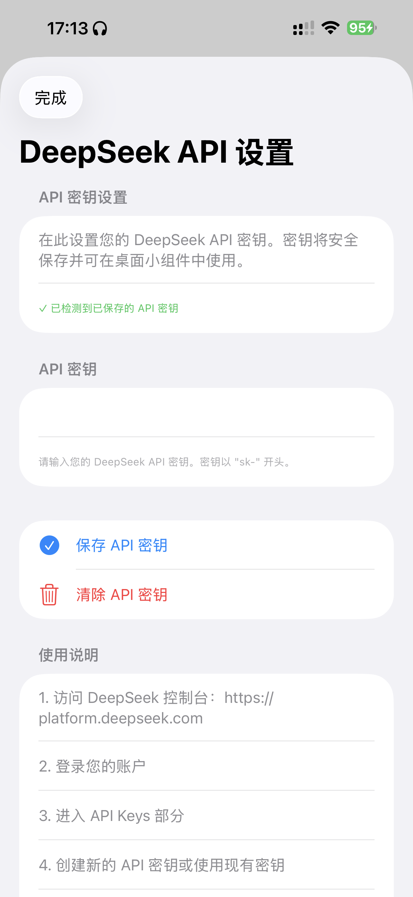
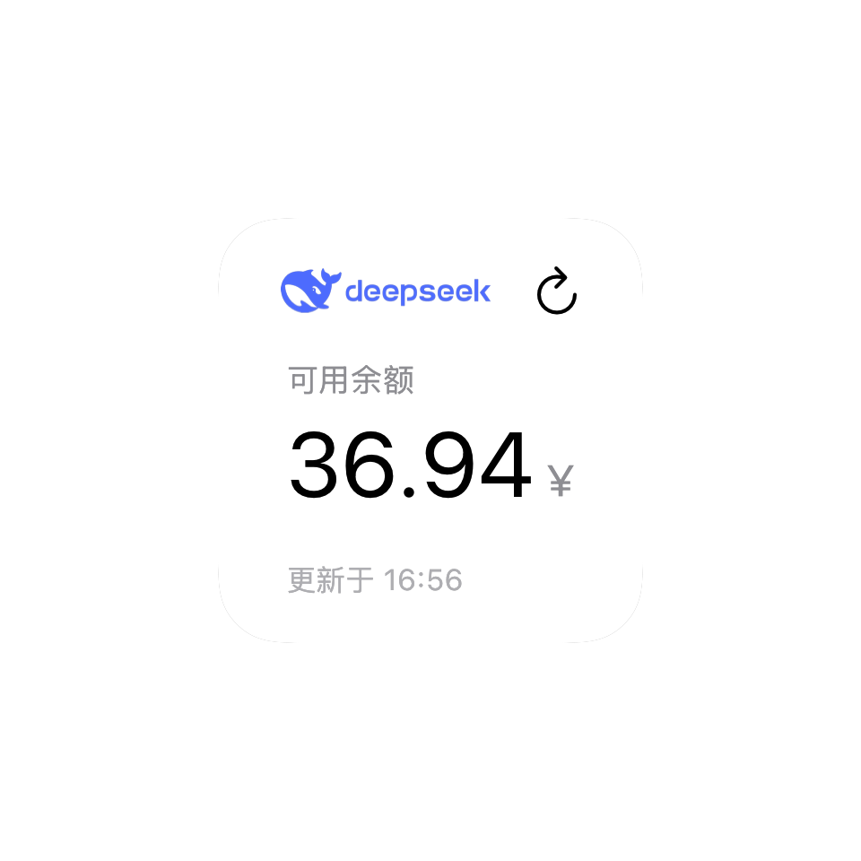
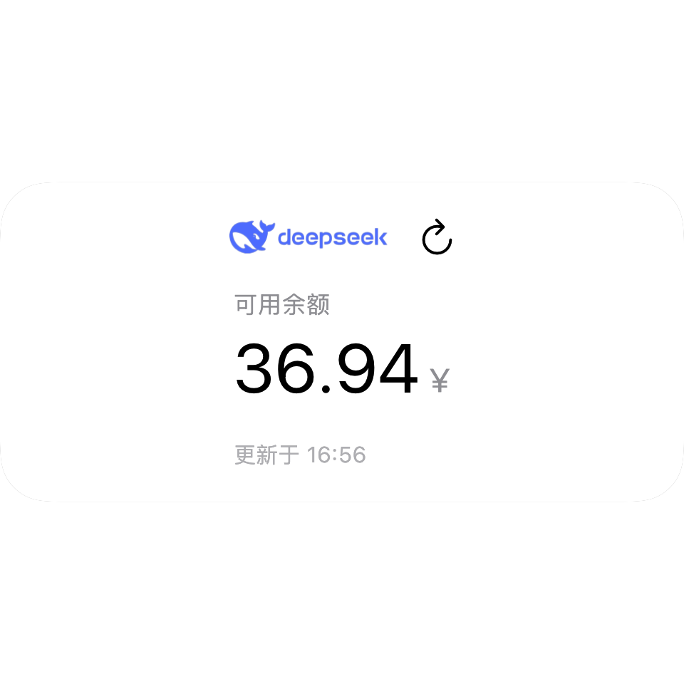

# DeepSeek 余额检查器

一个用于 Scripting App 的 DeepSeek API 余额检查器组件，包含 API 密钥设置表单和余额显示桌面小组件。

## 功能特性

- 🔐 **安全存储**：API 密钥使用 iOS Keychain 安全存储
- 📱 **桌面小组件**：在主屏幕显示 DeepSeek 账户余额
- ⚙️ **设置页面**：内置 API 密钥设置和管理界面
- 🔄 **自动刷新**：小组件定期自动更新余额信息
- 🌐 **多语言支持**：完整的中文界面
- 🔮 **未来扩展**：计划支持更多 AI API（如 OpenAI、Anthropic 等）

## 界面截图

### 设置API Key页面


### 桌面小型组件


### 桌面中型组件


## 项目结构

```
DeepSeekBalenceChecker/
├── script.json                 # 项目配置文件
├── index.tsx                   # API 密钥设置表单（主入口）
├── widget.tsx                  # 桌面小组件组件
├── constants.ts                # 共享常量配置
├── app_intents.tsx             # AppIntent 定义
└── DeepSeek余额.scripting      # 打包后的脚本文件
```

## 安装和使用

### 方法一：一键安装（推荐）

点击下方链接即可在 Scripting App 中直接安装此组件（需要在 iOS 设备的 Safari 浏览器中打开）：

[🔗 一键安装 DeepSeek 余额检查器](https://htmlpreview.github.io/?https://github.com/lilpard-mk/Scripting-scripts/blob/main/redirect/deepseek-balance.html)

或者使用重定向服务：
[📱 通过重定向服务安装](https://intradeus.github.io/http-protocol-redirector?r=scripting%3A%2F%2Fimport_scripts%3Furls%3Dhttps%3A%2F%2Fraw.githubusercontent.com%2Flilpard-mk%2FScripting-scripts%2Frefs%2Fheads%2Fmain%2FDeepSeekBalenceChecker%2FDeepSeek%25E4%25BD%2599%25E9%25A2%259D.scripting)

> **注意**：由于 GitHub 的安全策略，无法直接在 README 中使用 `scripting://` 协议链接。上述链接通过第三方重定向服务实现跳转功能。

或者，你也可以手动导入：
1. 在 Scripting App 中点击 "导入脚本"
2. 选择 `DeepSeek余额.scripting` 文件
3. 脚本将自动导入并显示在脚本列表中

### 方法二：源码导入

1. 将整个 `DeepSeekBalenceChecker` 文件夹复制到 Scripting App 项目目录
2. 在 Scripting App 中刷新脚本列表
3. 运行 `index.tsx` 打开设置页面

## 使用说明

### 1. 设置 API 密钥

1. 运行脚本，打开 DeepSeek API 设置页面
2. 访问 [DeepSeek 控制台](https://platform.deepseek.com) 获取 API 密钥
3. 复制以 "sk-" 开头的 API 密钥
4. 在设置页面粘贴并保存密钥

### 2. 添加桌面小组件

1. 长按 iOS 主屏幕进入编辑模式
2. 点击左上角 "+" 添加小组件
3. 搜索并选择 "Scripting"
4. 选择 "DeepSeek 余额" 小组件
5. 调整大小并添加到桌面

### 3. 查看余额

- 小组件将自动显示 DeepSeek 账户余额
- 余额信息每 5 分钟自动刷新
- 点击小组件可快速打开设置页面

## 技术说明

### 存储机制

- API 密钥使用 `Storage` API 存储在共享存储域
- 存储键名：`deepseek_api_key`
- 存储选项：`{ shared: true }`（允许小组件访问）

### 数据安全

- 所有 API 调用在设备本地完成
- 密钥仅用于向 DeepSeek API 发送请求
- 应用不会收集或传输任何用户数据

### 错误处理

- 网络错误：显示具体错误信息
- API 错误：显示状态码和错误内容
- 存储错误：提示重新设置密钥

## 开发说明

### 文件说明

- **index.tsx**：设置表单组件，使用 React Hooks 管理状态
- **widget.tsx**：桌面小组件，采用一次性渲染模式
- **constants.ts**：配置常量，包括 API 端点和存储键名
- **app_intents.tsx**：定义 AppIntent 用于小组件刷新

### 修改和定制

1. **修改样式**：编辑 widget.tsx 中的 JSX 代码
2. **更改刷新间隔**：修改 widget.tsx 中的 `policy` 参数
3. **添加新功能**：参考 Scripting App 官方文档

## 扩展计划

未来版本计划支持更多 AI API 提供商，包括但不限于：

- **OpenAI**：ChatGPT、GPT-4 等模型余额查询
- **Anthropic**：Claude 系列模型余额查询
- **Google AI**：Gemini 系列模型余额查询
- **其他主流 AI 服务**：如 Cohere、Midjourney 等

扩展实现思路：
1. 模块化 API 适配器架构
2. 统一密钥管理和存储界面
3. 可配置的 API 端点切换
4. 智能余额数据显示和格式转换

## 注意事项

- 确保网络连接正常，以便调用 DeepSeek API
- API 密钥有安全风险，请勿泄露
- 小组件可能需要重新加载才能使用新保存的密钥
- 所有界面文本均使用中文

## 版本信息

- 版本：1.0.0
- 更新日期：2026-01-02
- 适用于：Scripting App 框架

## 支持与反馈

如有问题或建议，请通过 GitHub Issues 提交反馈。

---

**免责声明**：此项目为第三方开发，与 DeepSeek 官方无关。使用 API 密钥需遵守 DeepSeek 相关条款。